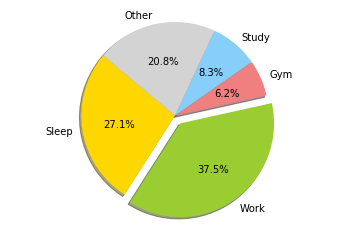

# CURRICULUM VITAE
## Luca Fontanili


```python
import pandas as pd
from IPython.core.display import display, HTML
import matplotlib.pyplot as plt
import numpy as np

import matplotlib.pyplot as plt
%matplotlib inline

display(HTML("""
<style>
.output {
    display: flex;
    align-items: center;
    text-align: center;
}
</style>
"""))
```


<style>
.output {
    display: flex;
    align-items: center;
    text-align: center;
}
</style>


## PERSONAL INFORMATION


```python
personal_info = {'Contact': ['Phone Number', 'e-mail', 'Skype Id', 
                             'Sex', 'Date of Birth', 'Nationality'],
                 'Detail': ['+39 340 5434453', 
                            'luca.fontanili93@gmail.com', 'luca.fontanili', 'Male', '22/01/1990', 'Italian']}

display(HTML("""<center><table><tr><td>{}</td>
                <td><iframe src="https://www.google.com/maps/embed?pb=!1m18!1m12!1m3!1d2831.1517727885257!2d10.327056116089658!3d44.798095479098734!2m3!1f0!2f0!3f0!3m2!1i1024!2i768!4f13.1!3m3!1m2!1s0x47806ae0cec03315%3A0x63674c9ddee412c0!2sBorgo+Riccio+da+Parma%2C+34%2C+43121+Parma+PR!5e0!3m2!1sen!2sit!4v1544393049528" width="600" height="450" frameborder="0" style="border:0" allowfullscreen></iframe>
                </td></table></center>""".format(pd.DataFrame(personal_info).to_html(escape=False, index=False))))
```


<center><table><tr><td><table border="1" class="dataframe">
  <thead>
    <tr style="text-align: right;">
      <th>Contact</th>
      <th>Detail</th>
    </tr>
  </thead>
  <tbody>
    <tr>
      <td>Phone Number</td>
      <td>+39 340 5434453</td>
    </tr>
    <tr>
      <td>e-mail</td>
      <td>luca.fontanili93@gmail.com</td>
    </tr>
    <tr>
      <td>Skype Id</td>
      <td>luca.fontanili</td>
    </tr>
    <tr>
      <td>Sex</td>
      <td>Male</td>
    </tr>
    <tr>
      <td>Date of Birth</td>
      <td>22/01/1990</td>
    </tr>
    <tr>
      <td>Nationality</td>
      <td>Italian</td>
    </tr>
  </tbody>
</table></td>
                <td><iframe src="https://www.google.com/maps/embed?pb=!1m18!1m12!1m3!1d2831.1517727885257!2d10.327056116089658!3d44.798095479098734!2m3!1f0!2f0!3f0!3m2!1i1024!2i768!4f13.1!3m3!1m2!1s0x47806ae0cec03315%3A0x63674c9ddee412c0!2sBorgo+Riccio+da+Parma%2C+34%2C+43121+Parma+PR!5e0!3m2!1sen!2sit!4v1544393049528" width="600" height="450" frameborder="0" style="border:0" allowfullscreen></iframe>
                </td></table></center>


[](https://github.com/lucafon)

[](https://www.linkedin.com/in/luca-fontanili/)

[](https://pypi.org/user/lucafon/)

_______________
## WORK EXPERIENCE

### March 2015 - Present, Computer Engineer – Software Development Leader

#### Ubiq S.R.L. - SIA Group, Parma/Milan

* Software Development Leader, coordinator of the Back-End development team (5+ developers)
* Development of Back-End system of different mobile applications in association with Poste Italiane (Extra Sconti, 100K+ active users per month), CartaSi (CashLessCity), Nivea (ConTATTO NIVEA), Barilla (Mio Mulino) and Samsung
* Business Logic Manager of the project iCoop, in collaboration with Coop Italia. Manager of the Back-End development of the new couponing system within the iCoop mobile app
* R&D Big Data: Development of the Back-End system and REST Web Services of Ti Frutta, an iOS and Android mobile app, using Data Mining and Machine Learning techniques on Cloud platform. Development of advanced and optimized algorithms to detect products on images of receipts using NoSQL databases (Solr, HBase) and OCR algorithms to read text from pictures using advanced image pre-processing techniques
* R&D Machine Learning: Study and development of a predictive model that finds similarities between texts of different images using Text Mining and ML techniques 
* R&D Computer Vision: Development of a server-side binarization algorithm of raw receipt images using different image processing approaches (edge-detection, features extraction, thresholding) using OpenCV in Python
* R&D Big Data: development of a reliable tool to import data from RDBMS to Hadoop ecosystem using Sqoop, Spark, Hive and Impala
* R&D Big Data: development of a data replication flow between different Solr instances using Flume and Python
* 3+ years’ experience on Java 8, lambdas and Design Patterns
* Hands-on experience with Front-End solutions development using Extjs and HTML. Knowledge of web development tools such as Firebug
* Experience with JMS and Apache ActiveMQ message broker
* Development of software solutions following agile practices (Kanban) and using versioning control systems such as SVN and Git
* Experience with TDD development using Junit framework for unit testing both in Java and Python
* Hands-on experience with WordPress plug-ins development using JavaScript and PHP
* Hands-on experience with different Hadoop clusters (Cloudera and Ambari)

**Business or sector** Computer Engineering, Big Data, Machine Learning
_________________
### August 2014 - February 2015, Software Engineering Intern

#### Datalogic ADC Inc, 55 W Del Mar Blvd, Pasadena (CA)
* R&D Computer Vision: working on the parallelization of a Computer Vision algorithm (Zero Mean Normalized Cross-Correlation), using the NVIDIA CUDA framework on a GPU embedded in a SoC (Tegra K1)
* Development of testing programs for Computer Vision software solutions using Python 

**Business or sector** Computer Vision

__________________
## EDUCATION AND TRAINING
### September 2012 - March 2015, Master's Degree in Computer Engineering QEQ7

#### University of Bologna, Bologna

* Computer vision, data mining, use of Hadoop framework, information security, artificial intelligence, computer networks, mobile systems, OpenCV, Java, C/C++, VHDL, IT, Real-Time systems.

**Thesis** *Development of parallel processing approach to compute Zero-mean Normalized Cross- Correlation. CUDA framework has been used to develop fast approach to detect characters in images, using Template Matching approach, based on Zero-mean Normalized Cross-Correlation measure.*

**Final Grade** 110/110 with Honours
______________
### September 2009 - July 2012, Bachelor's Degree in Computer Engineering QEQ6

#### University of Parma, Parma
* Computer science, mathematics, physic, industrial robotics, web programming, electronics, automatics, computer graphics, software engineering, Java, C/C++, OpenGL

**Thesis** *A Machine Learning project based on arm gesture recognition and humanoid imitation. Arm gestures are acquired by inertial motion sensors and modelled in an OpenGL 3D virtual space. A new method based on Functional Principal Component Analysis is used in MATLAB for both a supervised clustering of training data and gesture recognition. Recognized gestures are imitated by a small humanoid robot*

**Final grade** 107/110

______________
## PERSONAL SKILLS
### LANGUAGES

  
| Language | Listening | Reading | Spoken Interacion | Spoken Production | Writing |
| -------- | --------- | ------- | ----------------- | ----------------- | ------- |
| Italian | MT | MT | MT | MT| MT |
| English | C2 | C2 | C2 | C2 | C1 |
| German | A1 | A1 | A1 | A1 | A1 |

*Levels: A1/2: Basic user - B1/2: Independent user - C1/2 Proficient user - MT Mother Tongue*

### COMMUNICATION SKILLS
I gained good communication skills speaking and interacting with customers and clents. I'm also part of the Data Science and Artificial Intelligence Group in Parma, and I hold a speeck about Machine Learning topics once every few months, usually in front of dozens of peoples.

### ORGANISATIONAL/MANAGERIAL SKILLS
Excellent social/organisational skills acquired during my experience as Team Leader. During my time in Ubiq I had to completely manage different projects with many clients, organizing work packages and distributing them across the team members.

### JOB-RELATED SKILLS


```python
from bokeh.io import show, output_notebook
from bokeh.plotting import figure
from bokeh.palettes import RdPu9
from bokeh.transform import factor_cmap
from bokeh.models import HoverTool, ColumnDataSource
output_notebook()

job_skills = pd.read_csv('job_skills.csv', sep=';')
source = ColumnDataSource(job_skills)

p = figure(plot_width=800, plot_height=400, title="Experise level per skill",
           x_range=list(job_skills.description), toolbar_location=None)

index_cmap = factor_cmap('type', palette=RdPu9, factors=sorted(job_skills.type.unique()), end=1) 
p.vbar(x='description', top='level', width=1, source=source,
       line_color="white", fill_color=index_cmap)

p.y_range.start = 0
p.y_range.end = 10
p.x_range.range_padding = 0.1
p.xgrid.grid_line_color = None
p.xaxis.axis_label = "Skills grouped by type"
p.xaxis.major_label_orientation = 1.2
p.outline_line_color = None

hover = HoverTool()
hover.tooltips = [
    ('Name', '@description'),
    ('Type', '@type'),
    ("Details", "@tooltip")
]
p.tools.append(hover)


show(p)
```


    <div class="bk-root">
        <a href="https://bokeh.pydata.org" target="_blank" class="bk-logo bk-logo-small bk-logo-notebook"></a>
        <span id="43bd35f9-a216-4ed1-9401-2a33a5968bc7">Loading BokehJS ...</span>
    </div>


    ---------------------------------------------------------------------------

    FileNotFoundError                         Traceback (most recent call last)

    <ipython-input-3-bb3d346944ed> in <module>()
          6 output_notebook()
          7 
    ----> 8 job_skills = pd.read_csv('job_skills.csv', sep=';')
          9 source = ColumnDataSource(job_skills)
         10 


    /anaconda3/lib/python3.6/site-packages/pandas/io/parsers.py in parser_f(filepath_or_buffer, sep, delimiter, header, names, index_col, usecols, squeeze, prefix, mangle_dupe_cols, dtype, engine, converters, true_values, false_values, skipinitialspace, skiprows, nrows, na_values, keep_default_na, na_filter, verbose, skip_blank_lines, parse_dates, infer_datetime_format, keep_date_col, date_parser, dayfirst, iterator, chunksize, compression, thousands, decimal, lineterminator, quotechar, quoting, escapechar, comment, encoding, dialect, tupleize_cols, error_bad_lines, warn_bad_lines, skipfooter, skip_footer, doublequote, delim_whitespace, as_recarray, compact_ints, use_unsigned, low_memory, buffer_lines, memory_map, float_precision)
        707                     skip_blank_lines=skip_blank_lines)
        708 
    --> 709         return _read(filepath_or_buffer, kwds)
        710 
        711     parser_f.__name__ = name


    /anaconda3/lib/python3.6/site-packages/pandas/io/parsers.py in _read(filepath_or_buffer, kwds)
        447 
        448     # Create the parser.
    --> 449     parser = TextFileReader(filepath_or_buffer, **kwds)
        450 
        451     if chunksize or iterator:


    /anaconda3/lib/python3.6/site-packages/pandas/io/parsers.py in __init__(self, f, engine, **kwds)
        816             self.options['has_index_names'] = kwds['has_index_names']
        817 
    --> 818         self._make_engine(self.engine)
        819 
        820     def close(self):


    /anaconda3/lib/python3.6/site-packages/pandas/io/parsers.py in _make_engine(self, engine)
       1047     def _make_engine(self, engine='c'):
       1048         if engine == 'c':
    -> 1049             self._engine = CParserWrapper(self.f, **self.options)
       1050         else:
       1051             if engine == 'python':


    /anaconda3/lib/python3.6/site-packages/pandas/io/parsers.py in __init__(self, src, **kwds)
       1693         kwds['allow_leading_cols'] = self.index_col is not False
       1694 
    -> 1695         self._reader = parsers.TextReader(src, **kwds)
       1696 
       1697         # XXX


    pandas/_libs/parsers.pyx in pandas._libs.parsers.TextReader.__cinit__()


    pandas/_libs/parsers.pyx in pandas._libs.parsers.TextReader._setup_parser_source()


    FileNotFoundError: File b'job_skills.csv' does not exist


### OTHER SKILLS
**Sport**: 
* American Football, 4 years’ experience in the Parma Panthers, interaction with American staff and players. Participation in European Championship with the Italian National American Football team
* Development of projects of personal interest using latest mobile and web programming languages (Android, HTML, CSS, SQL, JavaScript, Python) and tools (Nutch crawler, SonarQube, Tesseract).

**Driving License**: B (own car)
______________
## ADDITIONAL INFORMATION
**Publications**

Arm Gesture Recognition and Humanoid Imitation Using Functional Principal Component Analysis,<br>
J. Aleotti, A. Cionini, L. Fontanili, S. Caselli,<br>
IEEE/RSJ International Conference on Intelligent Robotics and Systems (IROS),<br>
Tokyo, November 2013

**Honours and awards**

Bronze medal of sporting merit given by CONI

**Certifications**

* Machine Learning, Stanford University, [Coursera, #FGYRSK7XD8XG](https://www.coursera.org/account/accomplishments/verify/FGYRSK7XD8XG)
* Using Python for Research, Harvard University, [edX, #f079493d7801420388179e219e2a9d63](https://courses.edx.org/certificates/f079493d7801420388179e219e2a9d63)

**Projects**

* Ti Frutta – The very first "cash back" app in Italy that allows the customer to earn by shopping
* F Abbigliamento – development of the Fontanili Abbigliamento website using Wordpress CRM.
* CV – Eye Detector: development of an eye detector in C++ based on Normalized Cross Correlation, robust to light variation
* DSS – Hadoop: implementation in Apache Hadoop environment of the Distributed Solving Set algorithm for outlier detection in large distributed data sets, using the MapReduce model
* Parma Panthers Official:  development of the Android official application of the Parma Panthers, the American Football team 4 times champion of Italy in the main championship
* PicoPic: VHDL project of a Peripheral Interface Controller for a stereo vision system on FPGA, with a 8 bit RISC microprocessor PicoBlaze
* Wikiquote Search Engine: implementation of a web crawler for Wikiquote based on Apache Nutch and development of a Java search engine based on Apache Solr
* [pysqoop](https://pypi.org/project/pysqoop/): a Python package that lets you sqoop into HDFS data from RDBMS using Apache Sqoop (installable via pip)
* Member & Speaker of the Data Science & AI Group in Parma

______________
## MY DAY
Below an explosion of how a typical workday is composed


```python
labels = 'Sleep', 'Work', 'Gym', 'Study', 'Other'
sizes = [6.5, 9, 1.5, 2, 5]
colors = ['gold', 'yellowgreen', 'lightcoral', 'lightskyblue', 'lightgray'] 
explode = (0, 0.1, 0, 0, 0)
plt.pie(sizes, explode=explode, labels=labels, colors=colors, autopct='%1.1f%%', shadow=True, startangle=140)
 
plt.axis('equal')
plt.show()
```




